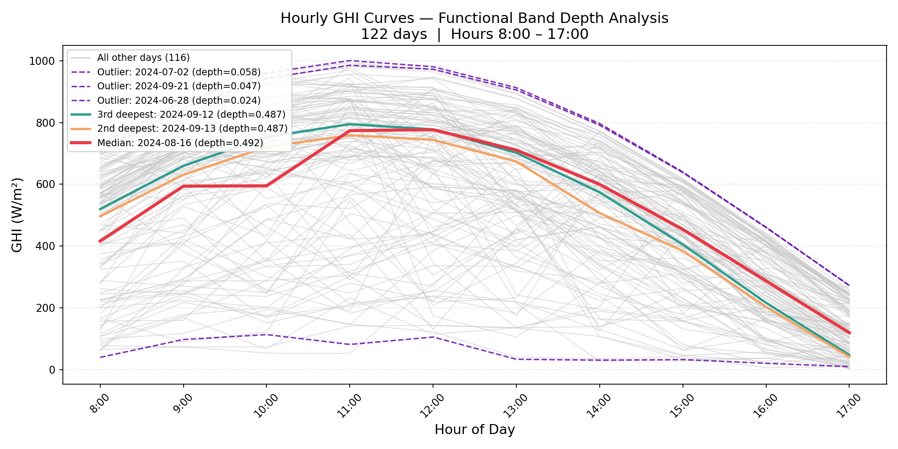
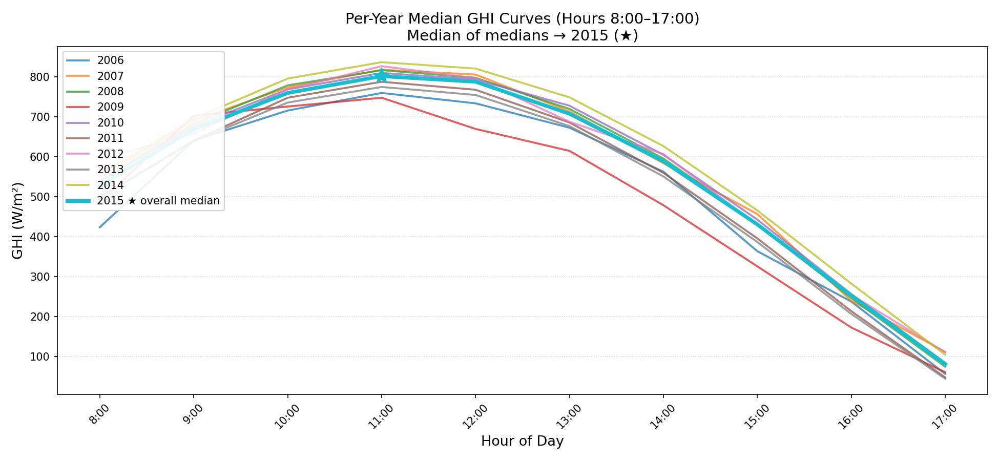
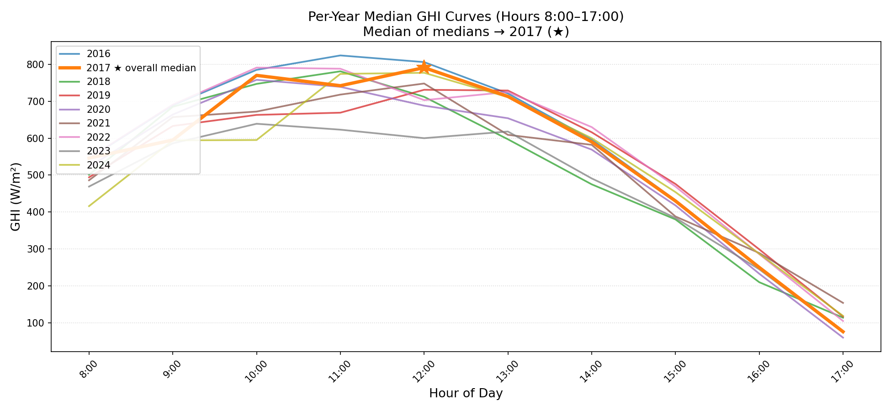
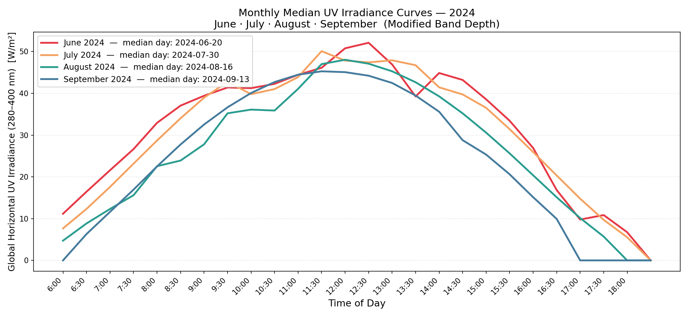
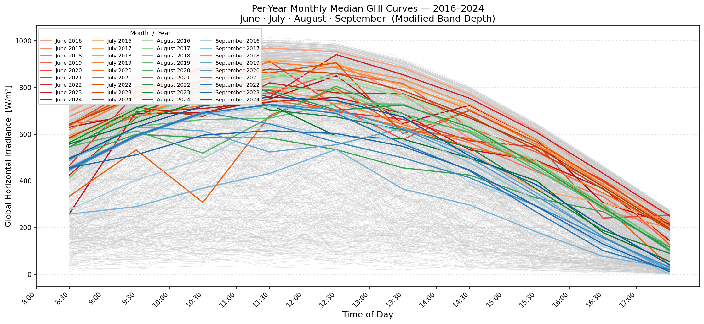

# Solar GHI Band Depth Analysis

Analysis of solar radiation trends using functional band depth on 27 years (1998–2024) of NSRDB data collected for Boston, MA.

Data was downloaded from the [NSRDB](https://nsrdb.nrel.gov/data-sets/us-data) at 30-minute intervals — one CSV per year. Band depth is used throughout to identify the most central (median) daily GHI curve within a set, as well as outliers.

---

## Setup

```bash
pip install -r requirements.txt
```

You will need a free NREL API key: https://developer.nrel.gov/signup/

---

## Data Collection

**`nsrdb_collector.py`** — fetches data from the NSRDB API and saves it as a single CSV in `data_csv/`.

```bash
python nsrdb_collector.py
```

The script will prompt for your API key, name, email, location coordinates, year/month range, and time interval.

---

## Analysis Steps

### Step 1a — Daily Median GHI Curve

**`step1a_ghi_band_depth.py`**

Loads the collected CSV, builds one GHI curve per day (hours 8–17), and computes modified band depth across all days. The most central curve (functional median) is highlighted in red, the next two runners-up in orange and teal, and the shallowest curves (outliers) in purple.

```bash
python step1a_ghi_band_depth.py
```



---

### Step 1b — Median of Medians Across Years

**`step1b_median_curves.py`**

Repeats the Step 1a analysis independently for each year in the dataset to get one median curve per year, then applies band depth again across those annual medians to find the overall "median of medians."

```bash
python step1b_median_curves.py
```

**2006–2015**



**2016–2024**



---

### Step 2a — Monthly Median GHI Curves

**`step2a_.py`**

For each of the four summer months (June–September), finds the median daily GHI curve across all years using band depth, then plots the four monthly medians together.

> Note: the original task specified 2025 data, but 2025 is not yet available on NSRDB. The analysis uses the most recent available year instead.

```bash
python step2a_.py
```



---

### Step 2b — Per-Year Monthly Median Curves

**`step2b_.py`**

Extends Step 2a by computing the monthly median curve for each individual year, producing one curve per (year, month) combination. Shading goes from light (oldest) to dark (newest) within each month's color family. All raw daily curves are shown in the background as grey lines.

```bash
python step2b_.py
```



---

## Data

Raw per-year CSV files are not committed to this repo. Run `nsrdb_collector.py` to regenerate `data_csv/`.

